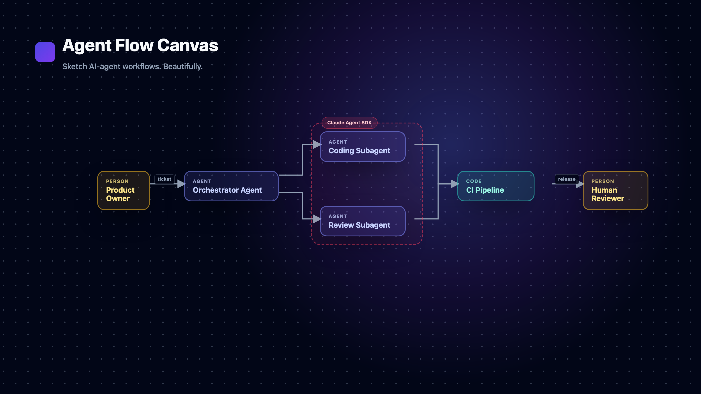

# Agent Flow Canvas



A fast, beautiful, local-first canvas for sketching **AI-agent workflows** — the
kind of diagram that shows a human handing a ticket to an orchestrator, which fans
out to subagents, which push into a CI platform, which comes back to a human
reviewer. Dark and light themes, smooth infinite canvas with the classic dotted
background, and first-class Mermaid import/export.

Built for **humans and agents alike**: everything the UI does is also available
through a local REST API — see [AGENTS.md](AGENTS.md).

## Features

- **Six block types**: Person (amber), Agent (indigo), Code (teal), Group (slate),
  Platform (red, with a searchable tool-logo picker over Simple Icons), and free
  Note (yellow sticky note, edited directly in place, no workflow semantics).
- **Groups that just work**: drop one block onto another and they become a group.
  A group's frame always at least hugs its members automatically — it can never
  clip one — but it can also be **freely resized** by dragging any of its 8
  handles to add extra breathing room on any side. Remove a member with
  right-click → *Remove from group*; dissolve a whole container with *Degroup*.
  Groups auto-dissolve when down to one member. Platforms behave identically,
  plus one rule: **they can never contain Person blocks** (agents and code only).
- **Folder-based storage**: pick a folder; every canvas is a plain JSON file in
  it. The foldable left sidebar lists, creates, renames and deletes canvases.
  Autosaves as you edit.
- **Mermaid both ways**: export any canvas as a `flowchart LR` (with containers
  as subgraphs and *real names* as node ids), and import that same dialect back —
  positions are computed automatically with a layered auto-layout. Notes are
  canvas-only annotations and are left out of the exported diagram.
- **Dark + light themes**, minimap, smooth pan/zoom, context menus, an inspector
  panel for labels/notes/types/logos. Edge labels default to sitting just above
  the line (never on top of it) and can be dragged anywhere along the edge.
- **Logs panel**: every failure (a failed save, import, or folder change) is
  recorded with full error detail, not just a toast that vanishes — open it
  from the 📋 icon in the toolbar.

## Quick start

```bash
npm install
npm run dev        # API server on :4001 + web UI on http://localhost:5173
```

Open the app, set your canvas folder in the sidebar (e.g. `~/canvases`), create a
canvas, and start sketching:

- **Add blocks** from the top toolbar or by right-clicking the canvas.
- **Connect** by dragging from a block's right handle to another block.
- **Group** by dragging one block onto another.
- **Right-click** anything for context actions.

For production use:

```bash
npm run build
npm start          # one process serves UI + API on http://127.0.0.1:4001
```

## Tests

```bash
npm test           # 70+ unit & API tests (Vitest + supertest)
npm run test:e2e   # browser end-to-end tests (Playwright)
```

## How it's put together

- **React + Vite + [React Flow](https://reactflow.dev)** for the canvas,
  **Tailwind v4** for styling, **Zustand** for state.
- A small **Express** server owns the canvas folder: validated, atomic,
  path-traversal-safe JSON file storage plus Mermaid import/export endpoints.
- All domain logic (grouping rules, derived container geometry, the Mermaid
  serializer/parser, auto-layout) lives in `shared/` as pure, unit-tested
  TypeScript used by both the client and the server.
- Key design decision: containers store **no size or position** — their rectangle
  is derived every render from their children. Coordinates are always absolute,
  so re-parenting a block is a pure data change and the UI can never drift.

## Non-goals

Not a general-purpose whiteboard, not real-time collaborative, not a workflow
*execution* engine — it draws the shape of a workflow; it doesn't run one.
